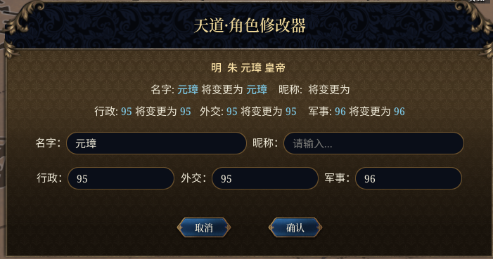

# 天道·修改器 （Tiandao modified）

一个EU5的Mod。

## 支持的功能

- **天道·角色修改器**：在角色交互菜单中添加 `天道·角色修改器` 按钮，支持自定义修改角色名字、昵称、军事、行政、外交。

## 安装与使用

1. 将 本项目全部下载下来把文件放入游戏的`mod`文件夹中。
2. 游戏启动后在mod管理里勾选`天道·修改器`。
3. 进入游戏后，右键点击任意角色，即可在菜单中看到天道系列功能。

## 注意事项

- **成就兼容性**：使用本 Mod 会修改游戏校验码（Checksum），导致无法获得官方成就。
- **联机说明**：由于采用了底层指令注入技术，本 Mod 仅建议在单机模式下使用。
- **实时生效**：所有修改在点击确认后立即生效，无需重启游戏或等待下月刷新。
- **未成年角色昵称修改后游戏不显示，成年后正常显示**
- **部分角色改名后显示旧名字，但是调试模式可以看到修改的新名字，这部分角色界面不使用FirstName而是使用ShortName，游戏目前没有提供接口来修改ShortName。**
